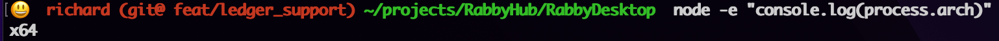
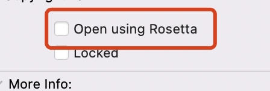

<br>

<p>
  Rabby desktop uses <a href="https://electron.atom.io/">Electron</a>, <a href="https://facebook.github.io/react/">React</a>, <a href="https://github.com/reactjs/react-router">React Router</a>, <a href="https://webpack.js.org/">Webpack</a> and <a href="https://www.npmjs.com/package/react-refresh">React Fast Refresh</a>.
</p>

<br>

<div align="center">

[![Build Status][github-actions-status]][github-actions-url]
[![Github Tag][github-tag-image]][github-tag-url]
[](https://discord.com/invite/seFBCWmUre)


</div>

## Install

Clone the repo and install dependencies:

```bash
git clone --depth 1 --branch main https://github.com/RabbyHub/RabbyDesktop.git RabbyDesktop
cd RabbyDesktop;
npm install
```

<!-- ### Setup RabbyX repo's location

Before start run electron app, make sure you setup RabbyX repository and run it locally.

```bash
git clone --depth 1 --branch feat/for_desktop https://github.com/RabbyHub/RabbyX.git RabbyX
```

**IMPORT** specify location of this repo (RabbyDesktop) as environment variable `RABBY_DESKTOP_REPO` in your shell (e.g. `~/.bashrc` or `~/.zshrc`)

```bash
export RabbyDesktop=/path/to/RabbyDesktop
```

The fallback value of `RABBY_DESKTOP_REPO` is the relative path `../RabbyDesktop` from `RabbyX` repo. So, if you put repos like below, you don't need to specify `RABBY_DESKTOP_REPO`.

```
~/Documents/RabbyX
~/Documents/RabbyDesktop
``` -->

### Native Modules

There's some node modules such as `node-hid` that need to be compiled for your platform, on running `npm install`, make sure you use node with arch corresponding to your electron version. Check your local node's arch:

```bash
node -e "console.log(process.arch)"
```

If you're using Apple Silicon but running node with arch `x64` like this: 



That's because you install node(maybe `x64` or `arm64`) and run it in rosetta2, You SHOULD:

1. switch back to node(arm64) by installing correct node
2. make sure you disable rosetta on node(arm64):



More information about [rosetta2](https://iboysoft.com/news/uninstall-rosetta-2.html#how-to-check-if-rosetta-2-is-installed)

### RabbyX Extension

on `postinstall`, we install rabbyx plugin AUTOMATICALLY. Check you have `assets/chrome_exts/rabbyx` folder after `npm install` finished, if not, you can install it manually:

```bash
npm run install:rabbyX
```

## Starting Development

<!-- Start the RabbyX Project's build process in a separate terminal:

```bash
cd /path/to/RabbyX;

# before build, we ensure the commit is correct
git fetch --all --prune;
git reset --hard origin/feat/for_desktop;

# run build
yarn build:dev
``` -->

Then start the app in the `dev` environment:

```bash
cd /path/to/RabbyDesktop;
npm start
```

**Experimental** for some reasons, you may wanna server files on `http://localhost:<port>` instead of custom protocol, set `HTTP_INSTEAD_OF_CUSTOM=true` on start development: 

```bash
HTTP_INSTEAD_OF_CUSTOM=true npm start
```

Then you can debug pages served on `http://localhost:<port>` that are served on custom protocol originally

### (Optional) Helpers

If you want to view RabbyX's storage, you need to install storage-area-explorer plugin:

```bash
sh scripts/install_devexts.sh
```

## Packaging for Production

To package apps for the local platform:

```bash
npm run package
```

<!-- ## Docs

See our [docs and guides here](https://rabby.io/desktop/docs/installation) -->

## Community

Join our Discord: https://discord.com/invite/seFBCWmUre

## Maintainers

- [Rabby]

[Rabby]:https://rabby.io

## License

MIT © [Rabby]

[github-actions-status]: https://github.com/RabbyHub/RabbyDesktop/workflows/Test/badge.svg
[github-actions-url]: https://github.com/RabbyHub/RabbyDesktop/actions
[github-tag-image]: https://img.shields.io/github/tag/RabbyHub/RabbyDesktop.svg?label=version
[github-tag-url]: https://github.com/RabbyHub/RabbyDesktop/releases/latest
[stackoverflow-img]: https://img.shields.io/badge/stackoverflow-electron_react_boilerplate-blue.svg
